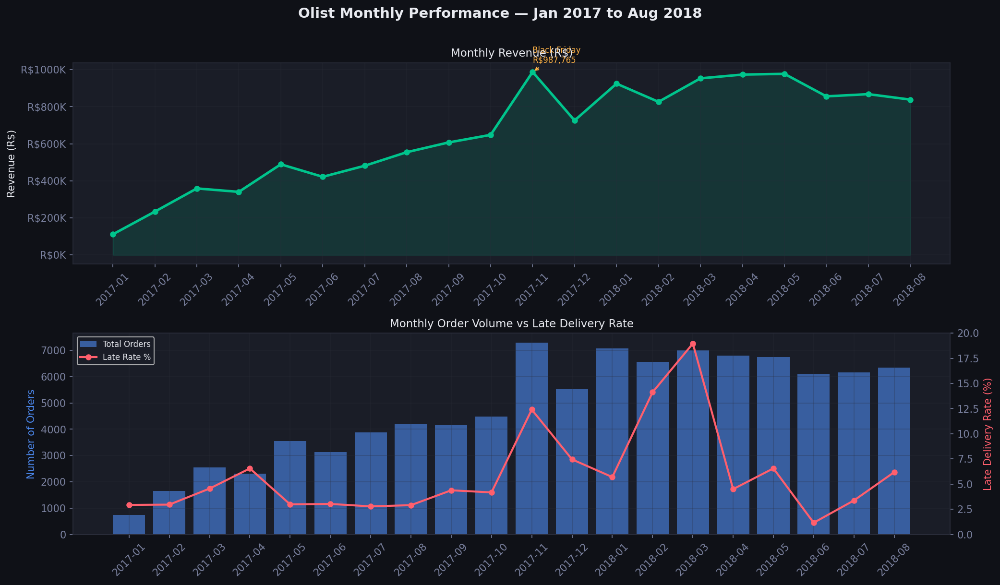
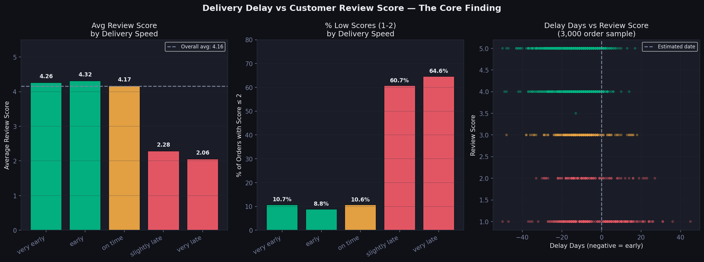
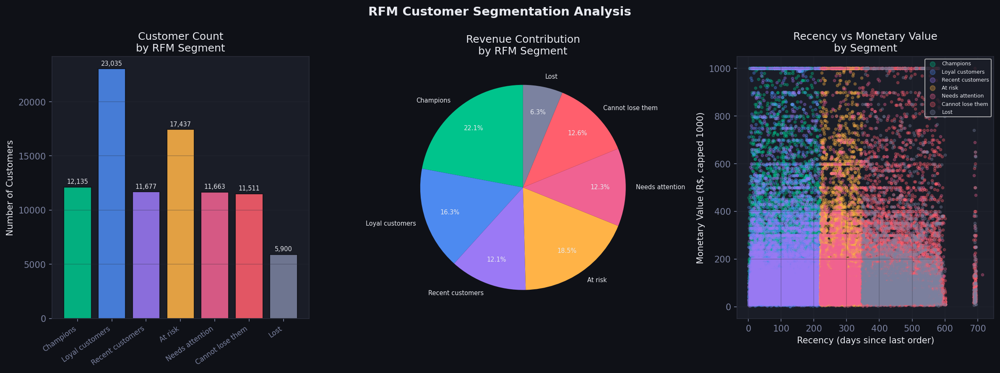
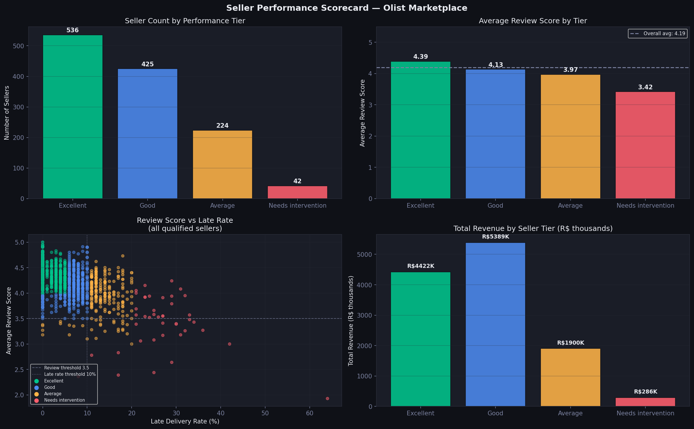

# Olist Brazilian E-Commerce Analytics

> End-to-end data analytics project on the Olist marketplace dataset  
> **100,000 orders · 9 relational tables · 2016–2018**

---

## Business Question

> *"What is driving delivery delays and low review scores on the Olist marketplace — and which sellers should be flagged for intervention?"*

---

## Live Dashboard

🔗 **[Open Interactive Power BI Dashboard](https://app.powerbi.com/view?r=eyJrIjoiNGRjZTNhYWYtYWUyYi00ZTQ3LTlhMmUtMWNjYWE5MTczODcyIiwidCI6Ijk2NDY0YThhLWY4ZWQtNDBiMS05OWUyLTVmNmI1MGEyMDI1MCIsImMiOjN9)**

| Page | Content |
|------|---------|
| Executive Overview | KPI cards, revenue trend, delivery speed impact |
| Delivery Analysis | Late rate by state, delay days analysis |
| Seller Scorecard | Tier distribution, intervention list |
| Customer Analytics | RFM segments, purchase frequency |
| Key Insights | 4 findings with actionable recommendations |

---

## Dashboard Preview









---

## Key Findings

| # | Finding | Impact |
|---|---------|--------|
| 1 | Late deliveries cause **6.6x more bad reviews** | Avg 2.27 vs 4.29 for on-time orders |
| 2 | **97% of customers never return** | Repeat buyers spend 78% more (R$245 vs R$138) |
| 3 | **42 sellers** flagged for intervention | Worst seller: 64% late rate, avg review 1.93 |
| 4 | AL state has **23.9% late rate** vs SP 5.9% | 4x geographic performance gap |
| 5 | Black Friday Nov 2017: **R$987K** revenue | 52% month-over-month spike |

---

## Statistical Validation

All findings confirmed — nothing here is random noise:

| Test | Feature | Result |
|------|---------|--------|
| T-test | delivery_delay vs review_score | t = 51.97, p < 0.0001 |
| T-test | is_late vs review_score | t = -89.3, p < 0.0001 |
| Chi-square | delivery_speed vs review_band | χ² = 8,432, p < 0.0001 |
| Point-biserial | delivery_delay_days | r = 0.31, p < 0.0001 |

---

## Tech Stack

```
SQL        → 14 queries · multi-table JOINs · CTEs · window functions · JULIANDAY()
Python     → pandas · matplotlib · seaborn · scipy · feature engineering · RFM
Power BI   → 5-page dashboard · DAX measures · conditional formatting · dark theme
```

---

## Project Structure

```
olist-ecommerce-analytics/
│
├── notebooks/
│   ├── analysis.ipynb           # Phase 2: Data loading, cleaning, EDA (18 cells)
│   └── deep_analysis.ipynb      # Phase 4: Deep analysis & visualisations (6 cells)
│
├── charts/                      # matplotlib/seaborn outputs
│   ├── fig1_monthly_trend.png
│   ├── fig2_delay_vs_review.png
│   ├── fig3_category_analysis.png
│   ├── fig4_rfm_segments.png
│   └── fig5_seller_scorecard.png
│
├── cleaned/                     # Processed datasets (small files only)
│   ├── olist_seller_scorecard.csv
│   ├── olist_rfm_segments.csv
│   ├── olist_monthly_trend.csv
│   └── olist_products_clean.csv
│
├── sql_results/                 # SQL query outputs
│   ├── revenue_by_category.csv
│   ├── delay_by_state.csv
│   ├── monthly_revenue_growth.csv
│   ├── seller_ranking.csv
│   ├── delay_vs_review.csv
│   ├── delivery_by_category.csv
│   ├── seller_intervention.csv
│   ├── repeat_purchase.csv
│   └── kpi_summary.csv
│
└── README.md
```

---

## Analysis Phases

| Phase | Description | Tools |
|-------|-------------|-------|
| 1 | Schema understanding — 9 table ERD, join keys, data traps | Documentation |
| 2 | Data loading, cleaning, EDA, feature engineering, RFM | Python, pandas |
| 3 | Multi-table SQL analysis — 14 queries across 7 areas | SQL, SQLite |
| 4 | Deep visualisation — 5 figures, statistical validation | matplotlib, scipy |
| 5 | Feature engineering | pandas, pd.cut, apply |
| 6 | Interactive dashboard — 5 pages, DAX measures | Power BI |

---

## Data Notes

**Large files excluded** from this repo due to GitHub 25MB limit:

| File | Size | How to recreate |
|------|------|-----------------|
| `olist_delivered_clean.csv` | 28MB | Run `notebooks/analysis.ipynb` Cell 1–18 |
| `olist_master.csv` | 24MB | Run `notebooks/analysis.ipynb` Cell 8 |
| `olist_dashboard.pbix` | 34MB | [Download from Google Drive](#) ← add your link |

**Raw dataset:** [Kaggle — Olist Brazilian E-Commerce](https://www.kaggle.com/datasets/olistbr/brazilian-ecommerce)  
9 CSV files · 100,000 orders · Free to download

---

## Key SQL Patterns Used

```sql
-- Multi-table JOIN with aggregation before joining (avoids row explosion)
WITH items_agg AS (
    SELECT order_id, SUM(price) AS revenue
    FROM items GROUP BY order_id
),
payments_agg AS (
    SELECT order_id, SUM(payment_value) AS total_paid
    FROM payments GROUP BY order_id
)
SELECT o.order_id, i.revenue, p.total_paid,
       AVG(r.review_score) AS avg_review,
       LAG(SUM(i.revenue)) OVER (ORDER BY strftime('%Y-%m', o.order_purchase_timestamp))
           AS prev_month_revenue
FROM orders o
JOIN items_agg    i ON o.order_id = i.order_id
JOIN payments_agg p ON o.order_id = p.order_id
JOIN reviews      r ON o.order_id = r.order_id
WHERE o.order_status = 'delivered'
GROUP BY o.order_id
```

---

## DAX Measures

```dax
Late Delivery Rate =
DIVIDE(
    CALCULATE(COUNTROWS(olist_delivered_clean),
              olist_delivered_clean[is_late] = 1),
    COUNTROWS(olist_delivered_clean), 0
)

Sellers Needing Intervention =
CALCULATE(
    COUNTROWS(olist_seller_scorecard),
    olist_seller_scorecard[seller_tier] = "D — Needs intervention"
)
```

---

## About

**Rahil Shaikh** — Data Analyst  
Master of Engineering Science in Data Science · SUNY Buffalo  
[LinkedIn](#) · [GitHub](#)
